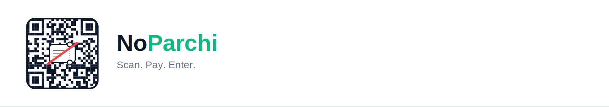

<p align="center">
  
</p>

<p align="center">
  <strong>Scan. Pay. Enter.</strong><br>
  No paper. No stolen cash.
</p>

---

Smart QR and WhatsApp commerce for India's unorganised sector — parking lots,
melas, street stalls. Customers pay by scanning a QR with no app installed and
get a digital pass; staff verify it at the exit with the merchant app.

The problem it exists to solve is cash theft at the gate. Every rupee is tied to
a pass code, every pass can be cleared exactly once, and every scan is recorded
against a named person.

## The name

A *parchi* is the paper slip you are handed at a gate and asked to keep safe.
It is also where the money goes missing: a slip can be reused, pocketed, or
never written at all. The mark is that slip struck through, inside the QR that
replaces it.

## Brand

| | |
|---|---|
| Wordmark | **No** in `slate-900` / `slate-100`, **Parchi** in the emerald accent |
| Tagline | Scan. Pay. Enter. |
| Mark | `assets/noparchi-app-icon.png` — app icon, favicon, splash |
| Lockup | `assets/noparchi-website.png` — mark + wordmark, for anywhere outside the app |

In the app, use `components/ui/Logo.tsx` rather than the PNGs. It draws the mark
on a `brand-paper` tile and sets the wordmark in live text, so it reads
correctly in both themes and stays sharp at any size.

Every colour comes from `src/config/theme.js`, in both light and dark. Change it
there and the whole app follows — Tailwind classes, raw React Native colour
props, and the theme toggle all read that one file.

## Stack

One Expo codebase for Android, iOS and web. Supabase for database, auth,
realtime and Edge Functions. TypeScript throughout, strict mode.

## Getting started

See **[docs/SETUP.md](docs/SETUP.md)** — Supabase project, migrations, Edge
Functions, and an end-to-end walkthrough you can click on a laptop.

```bash
npm install
cp .env.example .env    # fill in your Supabase URL and anon key
npm run web
```

## How it is put together

- `app/` — Expo Router screens. `(tabs)` is the merchant app (Dashboard, Ledger, Scanner, and the macOS-style Master-Detail Settings with 7 panes), `(auth)` is sign-in, `pay/` and `ticket/` are the public customer pages. Complete English and Hindi localization (`src/i18n`).
- `src/config/` — the things you will want to change: colours, permissions,
  pricing, providers. One file each.
- `src/services/` — data access, with payment and messaging behind swappable
  adapters.
- `supabase/migrations/` — the only source of truth for the database, including
  row level security and the atomic scan procedure.
- `supabase/functions/` — anything needing a secret: staff PIN sign-in, staff
  management, WhatsApp send, payment webhook.

Two rules worth knowing before changing anything:

**Tenant isolation is enforced in the database, not the client.** Every table has
row level security keyed on the signed-in user. A missing filter in app code
cannot leak another merchant's data.

**A pass can only be cleared once, and the database is what guarantees it.**
`ticket_validations.transaction_id` is UNIQUE, and `validate_ticket` takes a row
lock inside a single transaction. Do not move that logic into application code.

## Documentation

- [docs/SETUP.md](docs/SETUP.md) — setup, testing, and where to change things
- [docs/PHASE0_AUDIT.md](docs/PHASE0_AUDIT.md) — audit of the inherited codebase
